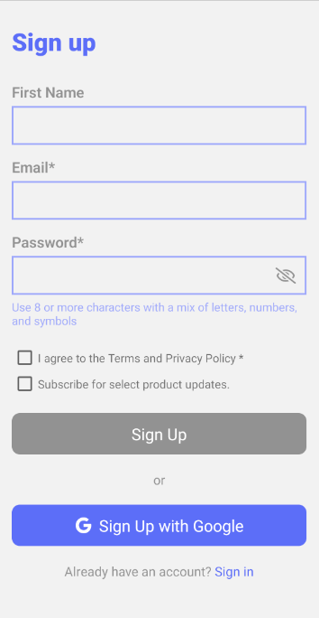
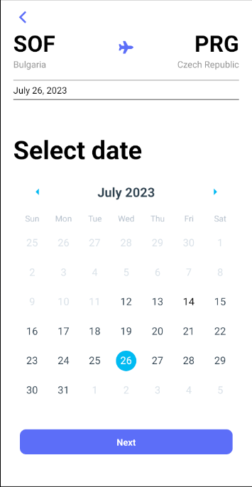

# 🥷 Reto de Programación

## App reservación de vuelos

> [Ver instrucciones antes de iniciar](./instructions/instructions.md)

## Table of contents
- [Description](#description)
- [Installation and Run](#installation-and-run)
- [Usage](#usage)
- [Credits](#credits)
- [App Screenshots](#app-screenshots)

## Description
"Reservation App" is a application developed in React Native, which allows users to book flights from their selected origin, destination, date and number of passengers. The app also allow to create a new user account and login with an existing one.

## Installation and Run
- Clone this repo.
- Install dependencies with `npm install`.
- Run `npm react-native start` to start the bundler.
- Run `npm react-native run-android` to run the app on Android.
- Run `npm react-native run-ios` to run the app on iOS.

## Usage
- The app will start on the login screen, where you can login with an existing user or a google account, also theres a button to redirect to the register screen.
- On the register screen you can create a new user account or use an existing google account.
- Once looged in you will be redirected to the My Flights screen, where you can see your booked flights, and also you can book a new flight by clicking on the Book button at the bottom of the screen.
- On the Book Flight screen you can select the origin, destination, date and number of passengers for your flight, and then click on the finish button to book the flight.
- Once the flight is booked you will be redirected to the My Flights screen, where you can see your booked flights.
- On the My Flights screen you can click on the logout button to logout from the app.

## Credits
- [BrightCoders](http://www.brightcoders.com/)
- [DerekAyala](@DerekAyala)
- [Eduardoespl](@Eduardoespl)

## App Screenshots
  
  
  
